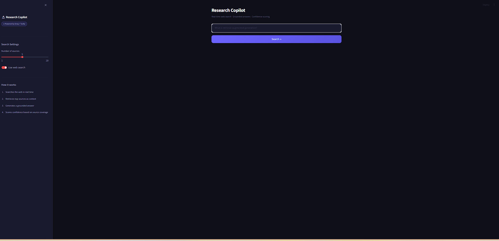
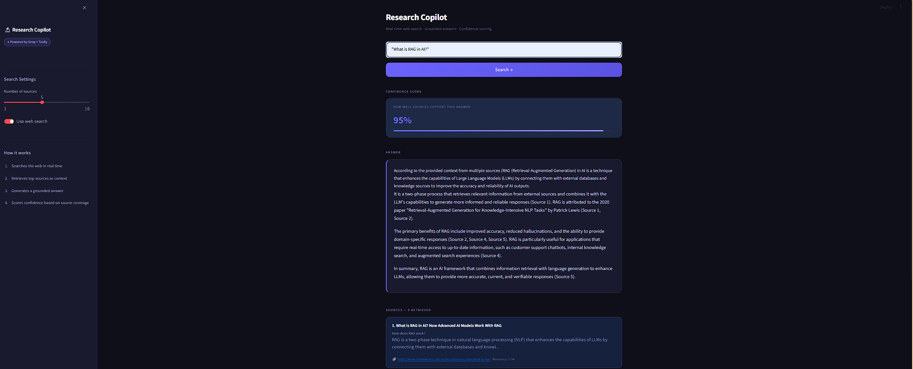

# Research Copilot

Most AI tools answer confidently and cite nothing. I built this to fix that.

The system expands your question into multiple search queries, searches the web for all of them, fuses results with Reciprocal Rank Fusion, re-ranks with BM25 + ChromaDB vector similarity, then streams a grounded answer with inline citations. A second LLM call scores how well the sources actually back up what was said.

Every design decision came from a real problem. Single-query search misses too much. A list of sources at the bottom is impossible to verify. Waiting 5 seconds for a full response feels broken in 2026.

## Screenshots

## How it works

1. You submit a question
2. Llama 3.3 70B generates 3 alternative phrasings of your query
3. Tavily searches the web for all 4 queries, fetching 3x more candidates than needed
4. Reciprocal Rank Fusion merges all result lists into one ranked pool
5. BM25 keyword scoring and ChromaDB vector embeddings re-rank by semantic relevance
6. Cohere neural re-ranker makes a final pass if COHERE_API_KEY is set
7. Llama streams an answer token by token with inline citations like [1][2]
8. A second LLM call scores confidence from 0 to 100%
9. Token usage and cost per query are logged to the sidebar dashboard
10. Every request is traced in LangSmith with full input/output visibility

I separated query expansion, retrieval, generation, and evaluation into distinct steps because each is a different problem. Combining them into a single prompt made all four worse.

## Document search

Web search alone doesn't help if the answer lives in a PDF on your desktop. I added a second retrieval path for that: upload a file, it gets chunked and embedded into a persistent vector index, and queries can pull from it instead of or alongside the web.

The two retrieval paths are deliberately separate systems, not one merged pipeline. Web search uses ephemeral, per-query BM25 + ChromaDB reranking — it exists for the length of one request and disappears. Document search uses LlamaIndex's `VectorStoreIndex` backed by a persistent ChromaDB collection on disk, so uploaded files stay searchable across restarts. Trying to force both through the same reranking logic would have meant either re-embedding documents on every query (slow) or caching web results permanently (stale). Keeping them as two toggles (`use_web_search`, `use_documents`) that can run independently or together was simpler and more honest about what each one actually does.

- Upload PDFs, `.txt`, or `.md` files via `/api/v1/documents/upload`
- Files are split into ~512-token chunks with `SentenceSplitter` and embedded with `BAAI/bge-small-en-v1.5`
- `/api/v1/research` and `/api/v1/research/stream` accept `use_documents: true` to pull from uploaded files, `use_web_search: true` for live web results, or both — results merge into one source list before generation

## Tech Stack

- FastAPI + Uvicorn - backend API
- SlowAPI - rate limiting (10 requests/minute)
- Streamlit - frontend with SSE streaming
- Groq (Llama 3.3 70B) - query expansion, answer generation, confidence scoring
- Tavily - real-time web search
- Reciprocal Rank Fusion - multi-query result merging
- BM25 (rank-bm25) - keyword re-ranking
- ChromaDB - vector similarity re-ranking + persistent document storage
- LlamaIndex - document chunking, embedding, and retrieval
- Cohere - neural re-ranker (optional)
- LangSmith - request tracing and observability
- Pydantic v2 - data validation
- pytest - testing
- Docker + docker-compose - containerization
- GitHub Actions - CI on every push

## Project Structure

app/
  core/
    config.py              # environment config, validated at startup
    prompts.py             # all prompts stored as constants
  models/
    schemas.py             # request and response shapes
  routers/
    research.py            # /research and /research/stream endpoints
    documents.py            # document upload/list/delete endpoints
  services/
    search_service.py      # query expansion + RRF + BM25 + ChromaDB + Cohere
    rag_service.py         # streaming answer generation
    confidence_service.py  # confidence scoring
    cost_tracker.py        # per-query token and cost logging
    document_service.py    # LlamaIndex ingestion + persistent vector search
frontend/
  streamlit_app.py         # streaming UI with cost dashboard
evals/
  eval_research.py         # Ragas evaluation - faithfulness and answer relevancy
tests/
  test_research.py         # 6 tests, no API key needed

## Running Locally

git clone https://github.com/saithrishadaggupati/research-copilot
cd research-copilot
python -m venv .venv
.venv\Scripts\activate
pip install -r requirements.txt
cp .env.example .env
uvicorn app.main:app --reload --port 8000
streamlit run frontend/streamlit_app.py

## Running with Docker

docker-compose up --build

## API Endpoints

- POST /api/v1/research - standard JSON response
- POST /api/v1/research/stream - SSE streaming response
- GET /api/v1/costs - cost dashboard data
- POST /api/v1/documents/upload - upload a PDF/txt/md file for indexing
- GET /api/v1/documents - list indexed documents
- DELETE /api/v1/documents/{doc_id} - remove a document from the index

## Evaluations

python evals/eval_research.py

Runs 5 queries through the live system and scores Faithfulness and Answer Relevancy using Ragas. Results saved to evals/results.json.

## Testing

pytest tests/ -v

All external API calls are mocked, so tests run without API keys.